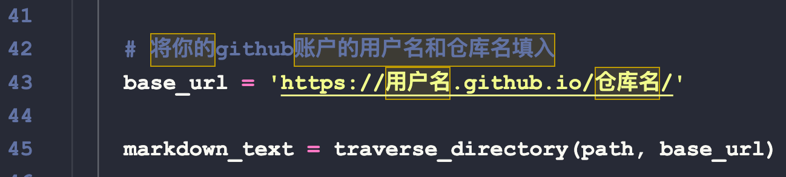
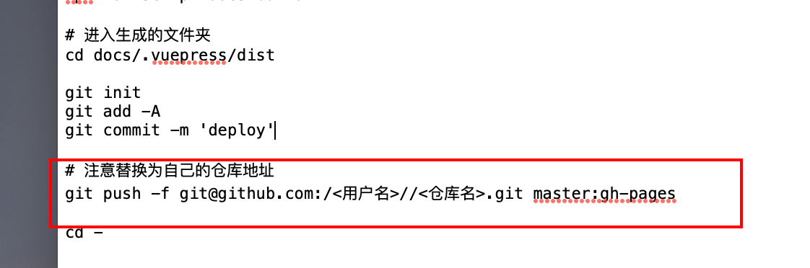

# 介绍
- 基于VuePress框架开发，加了几个python处理文件，shell脚本
- 快速的部署私人在线博客。本地笔记有时候需要在线查看，因此可以把它们放在github.io上
- 只需要将自己的本地笔记放在docs目录下，进行简单的配置后，运行shell脚本，就可以一键部署到github page上
- 博客首页是笔记的目录，点击可以快速的跳转笔记
- 笔记更新后，想同步到博客上，也只需运行`depoly.sh`脚本即可


# 快速上手

1. github上创建一个公开仓库，仓库名称为notebook（可以改变，但需要同步修改docs/.vuepress/config.js配置文件中的base属性）

2. 将所有的笔记放到docs文件夹下

3. 将文件`readHeader.py`第43行加上自己的github用户名和仓库名

   

4. 将文件`deploy.sh`第22行中加上自己的github用户名和仓库名

   

5. 在根目录下，打开终端依次运行命令

   ```bash
   # 初始化项目，安装依赖
   ./init.sh
   
   # 打包和部署 
   ./deploy.sh
   ```

6. 等几分钟后访问[https://用户名.github.io/仓库名/](https://用户名.github.io/仓库名/)即可

7. 以后需要更新博客只需要运行`.deploy.sh`即可


**如果觉得有用star✨支持一下😊**
